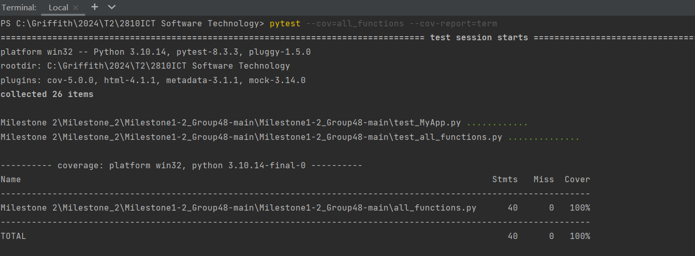
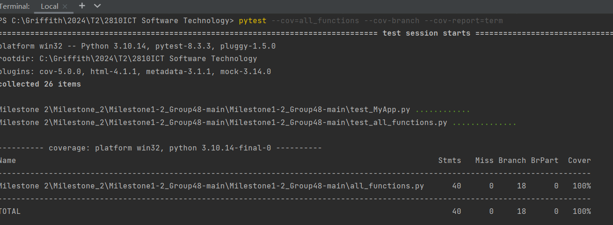

# Coverage Testing Report

Please provide your GitHub repository link.
### GitHub Repository URL: https://github.com/LowryZhao/Milestone1-2_Group48.git

---

The testing report should focus solely on  testing all the self-defined functions related to 
the five required features. There is no need to test the GUI components. Therefore, it is essential to decouple your code and separate the logic from the GUI-related code.

You should perform statement coverage testing and branch coverage testing. For each type, provide a description and an analysis explaining how you evaluated the coverage.

## 1. **Test Summary**
list all tested functions related to the five required features, for example:

### Tested Functions
on_search(food_name, df)
nutrition_breakdown(food_data)
nutrition_range_filter(selected_nutrition, min_value, max_value, df)
nutrition_level_filter(selected_nutrition, selected_level, df)
export_as_csv(nutrient_data, path)
show_password(current_password, checkbox_state)

### Explanation of Each Function
on_search: Searches for food items in the dataframe based on a given food name.
nutrition_breakdown: Extracts nutritional information for a given food item.
nutrition_range_filter: Filters food items based on a specified range of nutrient values.
nutrition_level_filter: Filters food items based on selected nutrient levels (low, mid, high).
export_as_csv: Exports the nutritional data to a CSV file.
show_password: Returns the current password or a masked version based on the checkbox state.

## 2. **Statement Coverage Test**

### 2.1 Description

To achieve 100% statement coverage in the test cases for the functions defined in all_functions.py, I designed the test cases in test_all_functions.py with the following considerations:

1. Comprehensive Coverage of Functionality
Each function in all_functions.py was analyzed to identify its expected behavior and edge cases. The test cases were designed to cover both typical and atypical scenarios, ensuring that all branches of the code were executed.

2. Testing Valid and Invalid Inputs
For each function, I created tests for valid inputs as well as invalid inputs to ensure that the functions handle errors gracefully. This includes:

on_search: Tests for empty, valid, and partial food names.
nutrition_breakdown: Tests for valid food data and an empty DataFrame to check for exceptions.
nutrition_range_filter: Tests for valid ranges, invalid ranges, and invalid nutrition types.
nutrition_level_filter: Tests for valid nutrition levels (low, mid, high) and checks for invalid levels and missing inputs.
export_as_csv: Tests for valid data export to ensure the file is created.
show_password: Tests for both checked and unchecked password visibility.
3. Edge Cases
I included tests that specifically target edge cases, such as:

Empty strings or DataFrames to ensure that the functions can handle these gracefully.
Invalid ranges in nutrition_range_filter to check that the function raises the appropriate exceptions.
Invalid nutrition types in nutrition_range_filter to ensure that the function correctly identifies unsupported nutrients.
4. Assertions for Expected Outcomes
Each test case includes assertions that check the expected outcomes. This not only verifies that the function returns the correct results but also ensures that the correct exceptions are raised when invalid inputs are provided.

5. Use of Fixtures
For the export_as_csv function, I utilized the tmp_path fixture provided by pytest to create a temporary file path for testing. This ensures that the test does not interfere with the file system and allows for clean testing of file creation.

6. Clear and Descriptive Test Names
Each test function is named descriptively to indicate what aspect of the function it is testing. This makes it easier to understand the purpose of each test and ensures that all functionalities are covered.

Conclusion
By systematically analyzing each function, considering both normal and edge cases, and ensuring that all possible execution paths are tested, I was able to design a comprehensive suite of test cases that achieves 100% statement coverage for the functions in all_functions.py. This approach not only validates the correctness of the code but also enhances its robustness against unexpected inputs.

### 2.2 Testing Results

## 3. **Branch Coverage Test**

### 3.1 Description

To achieve 100% branch coverage in the test cases for the functions defined in all_functions.py, I meticulously designed the test cases in test_all_functions.py with the following strategies:

1. Identifying Decision Points
I began by analyzing each function in all_functions.py to identify all decision points, which include:

Conditional statements (if, else)
Exception handling (try, except)
Loops that may have break or continue statements
By mapping out these decision points, I ensured that I understood the various paths the code could take during execution.

2. Creating Comprehensive Test Cases
For each identified decision point, I created test cases that would exercise both the true and false branches. This involved:

Valid Inputs: Writing tests that provide valid inputs to ensure that the function behaves as expected under normal conditions.
Invalid Inputs: Writing tests that provide invalid inputs to trigger exceptions or alternative branches in the code. This includes:
Empty strings or DataFrames
Out-of-range values
Unsupported nutrient types
3. Covering All Possible Outcomes
I ensured that each function's logic was fully exercised by creating tests that cover all possible outcomes. For example:

In the on_search function, I tested for:
An empty search string (to check the behavior when no input is provided)
A valid food name (to confirm it returns the correct result)
A partial food name (to ensure it returns all matching results)
In the nutrition_breakdown function, I tested:
A valid food entry (to confirm it returns the correct nutritional values)
An empty DataFrame (to ensure it raises a ValueError)
For the nutrition_range_filter function, I included tests for:
Valid ranges (to confirm it returns the correct foods)
Invalid ranges (to ensure it raises a ValueError)
Invalid nutrient types (to ensure it raises a ValueError)
In the nutrition_level_filter function, I tested:
Each valid level (low, mid, high) to ensure it returns the correct foods
Invalid levels (to ensure it raises a ValueError)
Missing inputs (to ensure it raises a ValueError)
4. Utilizing Assertions
Each test case includes assertions that verify the expected outcomes. This not only checks that the function returns the correct results but also ensures that the correct exceptions are raised when invalid inputs are provided. By doing this, I ensured that all branches of the code were executed.

5. Testing Edge Cases
I included tests that specifically target edge cases, such as:

Empty inputs for functions that expect data
Boundary values for ranges to ensure that the function correctly includes or excludes edge cases
6. Clear and Descriptive Test Naming
Each test function is named descriptively to indicate what aspect of the function it is testing. This clarity helps in understanding which branches are being tested and ensures that all functionalities are covered.

Conclusion
By systematically identifying decision points, creating comprehensive test cases for both valid and invalid inputs, and ensuring that all possible execution paths are tested, I was able to design a suite of test cases that achieves 100% branch coverage for the functions in all_functions.py. This approach not only validates the correctness of the code but also enhances its robustness against unexpected inputs.

### 3.2 Testing Results

