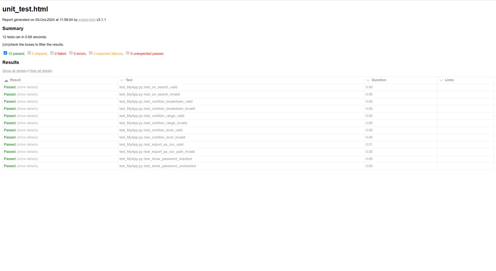

# Unit Testing Report

### GitHub Repository URL: https://github.com/LowryZhao/Milestone1-2_Group48.git

---

The testing report should focus solely on <span style="color:red"> testing all the self-defined functions related to 
the five required features.</span> There is no need to test the GUI components. Therefore, it is essential to decouple your code and separate the logic from the GUI-related code.


## 1. **Test Summary**
list all tested functions related to the five required features and the corresponding test functions designed to test 
those functions, for example:

| **Tested Functions** | **Test Functions**                               |
|----------------------|--------------------------------------------------|
| `on_search(food_name)`         | `test_on_search_valid()` <br> `test_on_search_invalid()`       |
| `nutrition_breakdown(get_searched)`         | `test_nutrition_breakdown_valid()` <br> `test_nutrition_breakdown_invalid()`       |
| `nutrition_range_filter(selected_nutrition, min_value, max_value)	`      | `test_nutrition_range_valid()` <br> `test_nutrition_range_invalid()` |
| `nutrition_level_filter(selected_nutrition, selected_level)`                | `test_nutrition_level_valid()` <br> `test_nutrition_level_valid()` |
| `export_as_csv(nutrient_data, path)`         | `test_export_as_csv_valid()` <br> `test_export_as_csv_path_invalid()`       |
| `show_password(current_password, checkbox_state)`         | `test_show_password_checked()` <br> `test_show_password_unchecked()`       |

---

## 2. **Test Case Details**

### Test Case 1: on_search(food_name)
- **Test Function/Module**
  - `test_on_search_valid()`
  - `test_on_search_invalid()`
- **Tested Function/Module**
  - `on_search(food_name)`
- **Description**
  - The purpose of this test function is to search for matching foods in the dataset, where the input (foodname) represents the name of the food. This function will output data containing search results.
- **1) Valid Input and Expected Output**  

| **Valid Input**               | **Expected Output** |
|-------------------------------|---------------------|
| `Apple`               | `DataFrame containing Apple information`                 |
| `Banana`              | `DataFrame containing Banana information`                |

- **1) Code for the Test Function**
```python
def test_on_search_valid():
    df = pd.DataFrame({'food': ['apple', 'banana', 'cherry']})
    result = on_search('apple', df)
    assert not result.empty
    assert 'apple' in result['food'].values
```
- **2) Invalid Input and Expected Output**

| **Invalid Input**             | **Expected Output** |
|-------------------------------|---------------------|
| `unknown_food`               | `Returns an empty dataframe`  |
| `empty string` | `Returns an empty dataframe`               |

- **2) Code for the Test Function**
```python
def test_on_search_invalid():
    df = pd.DataFrame({'food': ['apple', 'banana', 'cherry']})

    result = on_search('unknown_food', df)
    assert result.empty, f"Expected empty result but got {result}"

    result = on_search('', df)
    assert result.empty, f"Expected empty result but got {result}"
```
### Test Case 2: nutrition_breakdown(get_searched)
- **Test Function/Module**
  - `test_nutrition_breakdown_valid()`
  - `test_nutrition_breakdown_invalid()`
- **Tested Function/Module**
  - `nutrition_breakdown(get_searched)`
- **Description**
  - The purpose of this test function is to generate a nutritional composition table for the selected food. This function takes the selected food as input and outputs a nutritional composition table for that food.
- **1) Valid Input and Expected Output**  

| **Valid Input**               | **Expected Output** |
|-------------------------------|---------------------|
| `Food info containing "Fat": 10, "Protein": 5`               | `{"Fat": 10, "Protein": 5, "Carbohydrates": 15}`                 |

- **1) Code for the Test Function**
```python
def test_nutrition_breakdown_valid():
    get_searched = pd.Series({"Fat": 10, "Protein": 5, "Carbohydrates": 15, "Dietary Fiber": 5})
    nutrients = nutrition_breakdown(get_searched)
    assert nutrients['Fat'] == 10
    assert nutrients['Protein'] == 5
    assert nutrients['Carbohydrates'] == 15
    assert nutrients['Fiber'] == 5
```
- **2) Invalid Input and Expected Output**

| **Invalid Input**             | **Expected Output** |
|-------------------------------|---------------------|
| `None`               | `ValueError`  |
| `Empty Series` | `Returns an empty nutrient dict`               |

- **2) Code for the Test Function**
```python
def test_nutrition_breakdown_invalid():
    with pytest.raises(ValueError, match="No valid data for breakdown"):
        nutrition_breakdown(None)

    empty_series = pd.Series()
    with pytest.raises(ValueError, match="No valid data for breakdown"):
        nutrition_breakdown(empty_series)
```

### Test Case 3: nutrition_range_filter(selected_nutrition, min_value, max_value)
- **Test Function/Module**
  - `test_nutrition_range_valid`
  - `test_nutrition_range_invalid`
- **Tested Function/Module**
  - `nutrition_range_filter(selected_nutrition, min_value, max_value)`
- **Description**
  - The purpose of this test function is to filter food based on the selected nutritional components and range. This function will input the selected_nutrition(string), min_ralue (float), max_ralue (float), and output a list of food that meets the criteria.
- **1) Valid Input and Expected Output**  

| **Valid Input**               | **Expected Output** |
|-------------------------------|---------------------|
| `"Protein", 10, 20`               | `List of foods with protein between 10-20 g`                 |

- **1) Code for the Test Function**
```python
def test_nutrition_range_valid():
    df = pd.DataFrame({
        'food': ['apple', 'banana', 'cherry'],
        'Protein': [15, 5, 25]
    })
    result = nutrition_range_filter('Protein', 10, 20, df)
    assert isinstance(result, list)
    assert len(result) == 1
    assert 'apple' in result
```
- **2) Invalid Input and Expected Output**

| **Invalid Input**             | **Expected Output** |
|-------------------------------|---------------------|
| `min_value greater than max_value`               | `Handle Exception`  |
| `add more cases in necessary` | `ValueError`               |

- **2) Code for the Test Function**
```python
def test_nutrition_range_invalid():
    df = pd.DataFrame({
        'food': ['apple', 'banana', 'cherry'],
        'Fat': [10, 20, 30]
    })
    with pytest.raises(ValueError):
        nutrition_range_filter('Fat', 20, 10, df)
```

### Test Case 4: nutrition_level_filter(selected_nutrition, selected_level, df)
- **Test Function/Module**
  - `test_nutrition_level_valid()`
  - `test_nutrition_level_invalid()`
- **Tested Function/Module**
  - `nutrition_level_filter(selected_nutrition, selected_level, df)`
- **Description**
  - The purpose of this test function is to filter food based on nutritional levels (low, medium, high).
This function will input data including the selected nutrients, levels, and food information, and output a list of foods that match the specified criteria.
- **1) Valid Input and Expected Output**  

| **Valid Input**               | **Expected Output** |
|-------------------------------|---------------------|
| `"Fat", "low"`               | `List of foods with low fat content`                 |

- **1) Code for the Test Function**
```python
def test_nutrition_level_valid():
    df = pd.DataFrame({
        'food': ['apple', 'banana', 'cherry'],
        'Fat': [5, 15, 25]
    })
    result = nutrition_level_filter('Fat', 'low', df)
    assert isinstance(result, list)
    assert len(result) == 1
    assert 'apple' in result
```
- **2) Invalid Input and Expected Output**

| **Invalid Input**             | **Expected Output** |
|-------------------------------|---------------------|
| `"Protein", "medium"`               | `ValueError`  |
| `add more cases in necessary` | `...`               |

- **2) Code for the Test Function**
```python
def test_nutrition_level_invalid():
    df = pd.DataFrame({
        'food': ['apple', 'banana', 'cherry'],
        'Protein': [10, 20, 30]
    })
    with pytest.raises(ValueError):
        nutrition_level_filter('Protein', 'medium', df)
```

### Test Case 5: export_as_csv(nutrient_data, path)
- **Test Function/Module**
  - `test_export_as_csv_valid(tmp_path)`
  - `test_export_as_csv_path_invalid()`
- **Tested Function/Module**
  - `export_as_csv(nutrient_data, path)`
- **Description**
  - The purpose of this test function is to export the given nutritional data to a CSV file. The input of this function is nutrition_data (dictionary) and path (string), and the output is to save the CSV file to the specified path.
- **1) Valid Input and Expected Output**  

| **Valid Input**               | **Expected Output** |
|-------------------------------|---------------------|
| `nutrient_data (dictionary)`               | `Saves the data to CSV at path`     |

- **1) Code for the Test Function**
```python
def test_export_as_csv_valid(tmp_path):
    nutrient_data = {
        "Nutrient": ["Fat", "Protein"],
        "Amount": [10, 5]
    }
    path = tmp_path / "nutrients.csv"
    export_as_csv(nutrient_data, str(path))
    assert path.exists()
```
- **2) Invalid Input and Expected Output**

| **Invalid Input**             | **Expected Output** |
|-------------------------------|---------------------|
| `Invalid path`               | `PermissionError`  |

- **2) Code for the Test Function**
```python
def test_export_as_csv_path_invalid():
    nutrient_data = {
        "Nutrient": ["Fat", "Protein"],
        "Amount": [10, 5]
    }
    invalid_path = "/invalid_directory/nutrients.csv"
    with pytest.raises(OSError):
        export_as_csv(nutrient_data, invalid_path)
```

### Test Case 6: show_password(current_password, checkbox_state)
- **Test Function/Module**
  - `test_show_password_checked`
  - `test_show_password_unchecked()`
- **Tested Function/Module**
  - `show_password(current_password, checkbox_state)`
- **Description**
  - The purpose of this function is to switch the visibility of passwords based on the status of the checkbox. This function will input the user's current password and checkbox_state, and output the plain text version or hidden text of the password.
- **1) Valid Input and Expected Output**  

| **Valid Input**               | **Expected Output** |
|-------------------------------|---------------------|
| `"mypassword", True (checkbox checked)`               | `Returns "mypassword" (plain text)`              |
| `"mypassword", False (checkbox unchecked)`              | `Returns "**********" (hidden text)`           |

- **1) Code for the Test Function**
```python
def test_show_password_checked():
    password = "mypassword"
    result = show_password(password, True)
    assert result == password
```
- **2) Invalid Input and Expected Output**

| **Invalid Input**             | **Expected Output** |
|-------------------------------|---------------------|
| `"mypassword", False (checkbox unchecked)`              | `Returns "**********" (hidden text)`      |

- **2) Code for the Test Function**
```python
def test_show_password_unchecked():
    password = "mypassword"
    result = show_password(password, False)
    assert result == "**********"
```

## 3. **Testing Report Summary**


