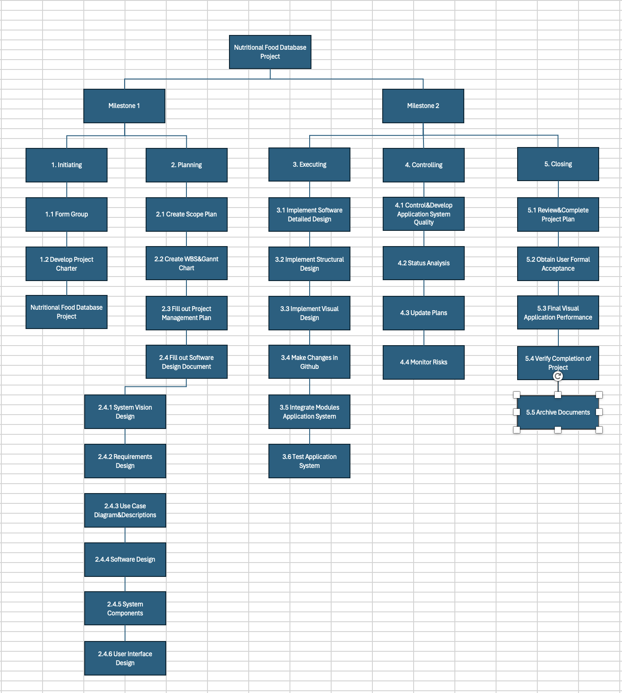
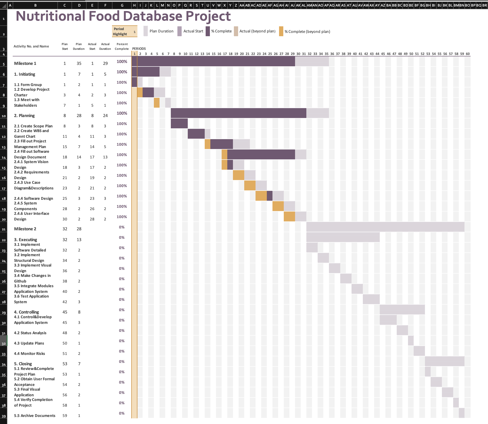

# Project Plan

## Project Name: Nutritional Food Database Project
## Group Number: 48

### Team members

| Student No. | Full Name | GitHub Username | Contribution (sum to 100%) | 
|-------------|-----------|-----------------|----------------------------|
| s5290341    | Zhongyue Qiu| Leia-Q0107    | 33.3% or Equal             |
| s5226106    | Lowry Zhao | LowryZhao      | 33.3% or Equal             | 
| s5261308    | Jiaxin Lin | AllenLinAU     | 33.3% or Equal             | 

### Brief Description of Contribution

Please Describe what you have accomplished in this group project.
- s5290341, Zhongyue Qiu
  - Accomplishments: I completed the gantt chart, WBS, and Use Case Diagram. Also, a main part of project plan.
- s5226106, Lowry Zhao
  - Accomplishments: Describe what you have completed or achieved
- s333333, Jiaxin Lin
  - Accomplishments: Describe what you have completed or achieved

# Table of Contents

* [Project Plan](#project-plan)
  * [1. Project Overview](#1-project-overview)
    * [1.1 Project Objectives](#11-project-objectives)
    * [1.2 Project Stakeholders](#12-project-stakeholders)
    * [1.3 Project Scope](#13-project-scope)
  * [2. Work Breakdown Structure](#2-work-breakdown-structure)
  * [3. Activity Definition Estimation](#3-activity-definition-estimation)
  * [4. Gantt Chart](#4-gantt-chart)

## 1. Project Overview

### 1.1 Project Objectives

Establish objectives or goals that the project aims to achieve.

### 1.2 Project Stakeholders

Identify all key stakeholders involved in the project, including internal teams and potential end-users.

### 1.3 Project Scope

Define and manage what is included or excluded in the project and product.

## 2. Work Breakdown Structure

Include the Work Breakdown Structure (WBS) for the entire project. WBS should be presented as a hierarchical diagram. Use the elements from the WBS to define activities in Section 3, and schedule these activities in the Gantt Chart in Section 4. Ensure all project activities are considered and included in the WBS.

## 3. Activity Definition Estimation

Define the activities required for your project based on the WBS, and assign responsibilities to team members. Each activity should be numbered and correspond with your Gantt chart. Provide estimated durations for each activity to facilitate Gantt chart preparation.

| Activity #No | Activity Name                   | Brief Description | Duration | Responsible Team Members |
|--------------|---------------------------------|-------------------|----------|--------------------------|
| 1.1          | Form Group                      | 3 persons         | 1 Day    | Zhongyue&Lowry&Jiaxin    |
| 1.2          | Develop Project Charter         | Project overview  | 3 Days   | All                      |
| 1.3          | Meet with Stakeholders          | Shedule meeting   | 1 Days   | All                      |
| 2.1          | Create Scope Plan               | Plan project scope| 3 Days   | Zhongyue                 |
| 2.2          | Create WBS and Gantt Chart      | Tasks Schedule    | 3 Days   | Zhongyue                 |
| 2.3          | Fill out Project Management Plan| Project plan      | 5 Days   | Zhongyue                 |
| 2.4          | Fill out Software Design Document| Software design  | 13 Days  | All                      |
| 2.4.1        | System Vision Design            | Background&Benefit| 2 Days   | Lowry                    |
| 2.4.2        | Requirements Design             | User&Software     | 2 Days   | Jiaxin                   |
| 2.4.3        | Use Case Diagram&Descriptions   | System-level      | 2 Days   | Zhongyue                 |
| 2.4.4        | Software Design                 | Flowchart&operation| 3 Days  | All                      |
| 2.4.5        | System Components Descriptions&Design| Function     | 2 Days   | All                      |
| 2.4.6        | User Interface Design           | Detailed Design   | 2 Days   | All                      |
| 3.1          | Implement Software Detailed Design| Implement Design| 2 Days(Plan)| All                   |
| 3.2          | Implement Structural Design     | Implement Design  | 2 Days(Plan)| All                   |
| 3.3          |Implement Visual Design          | Implement Design  | 2 Days(Plan)| All                   |
| 3.4          | Make Changes in Github          | Update changes    | 2 Days(Plan)| All                   |
| 3.5          | Integrate Modules Application System| Integration   | 2 Days(Plan)| All                   |
| 3.6          | Test Application System         | Testing           | 3 Days(Plan)| All                   |
| 4.1          | Control&Develop Application System Quality | Quality| 3 Days(Plan)| All                   |
| 4.2          | Status Analysis                 | Design Analysis   | 2 Days(Plan)| Lowy&Jiaxin           |
| 4.3          | Update Plans                    | Update Schedule   | 1 Days(Plan)| Zhongyue              |
| 4.4          | Monitor Risks               |Implement Risk Response| 2 Days(Plan)| Lowry                 |
| 5.1          | Review&Complete Project Plan    | Check Details     | 1 Days(Plan)| Zhongyue              |
| 5.2          | Obtain User Formal Acceptance   | User Test         | 2 Days(Plan)| Jiaxin                |
| 5.3          | Final Visual Application Performance | Visualisation| 2 Days(Plan)| All                   |
| 5.4          | Verify Completion of Project    | Completed         | 1 Days(Plan)| All                   |
| 5.5          | Archive Documents               | Zip Documents     | 1 Days(Plan)| Zhongyue              |

## 4. Gantt Chart
You have to use the provided Gantt chart template.  

Use the provided Gantt chart template to list all items from the Activity Definition along with relevant estimates 
and scheduling. Ensure that the Gantt chart reflects the activity definitions from Section 3. Track actual start 
times and durations. Besides including Gantt chart here, you should also submit your Gantt chart file separately.

