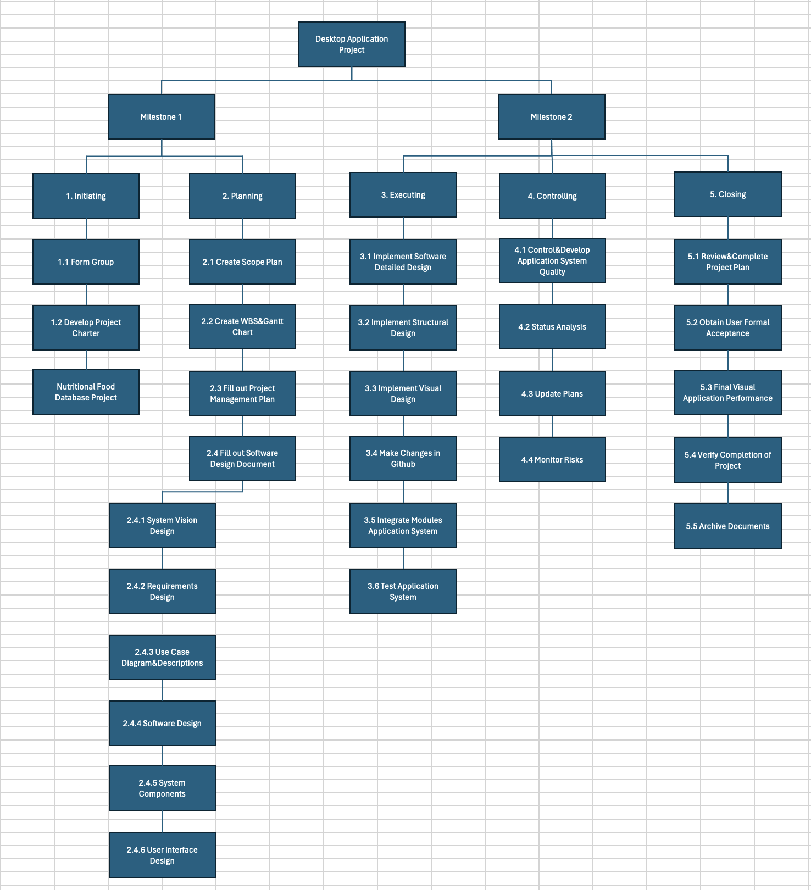
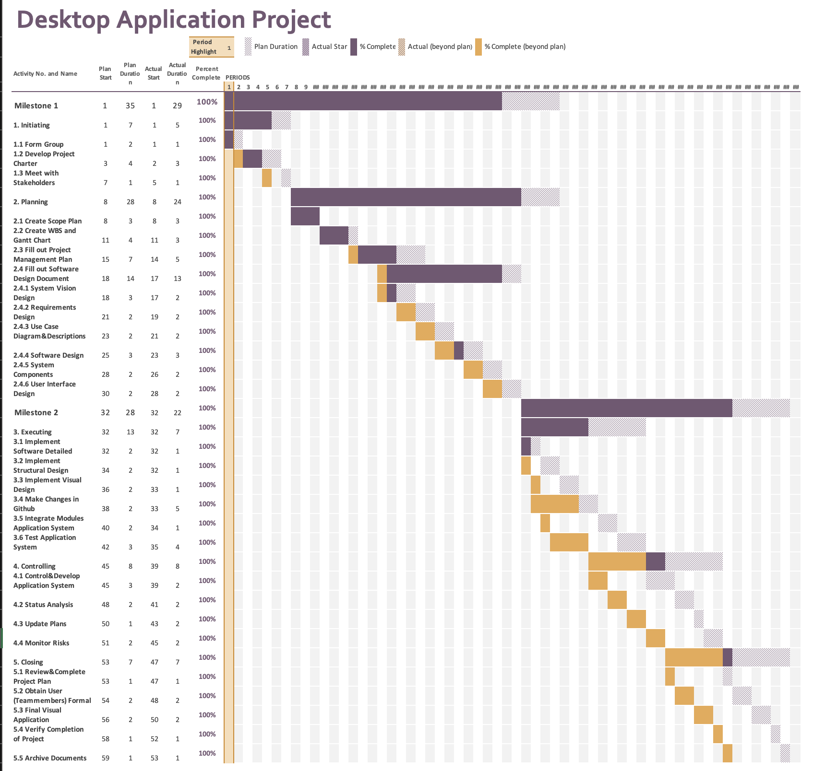

# Project Plan

## Project Name: Desktop Application Project
## Group Number: 48

### Team members

| Student No. | Full Name | GitHub Username | Contribution (sum to 100%) | 
|-------------|-----------|-----------------|----------------------------|
| s5290341    | Zhongyue Qiu| Leia-Q0107    | 33.3% or Equal             |
| s5226106    | Lowry Zhao | LowryZhao      | 33.3% or Equal             | 
| s5261308    | Jiaxin Lin | AllenLinAU     | 33.3% or Equal             | 

### Brief Description of Contribution

Please Describe what you have accomplished in this group project.
- s5290341, Zhongyue Qiu
  - Accomplishments: I completed the gantt chart, WBS, Use Case Diagramm and descriptions, software design, detailed design and visual design. 
    Also, a main part of project plan.
- s5226106, Lowry Zhao
  - Accomplishments: I completed the Problem background, System capabilities/overview, Benefit Analysis, Structural Design, Submission and organization of all documents.
- s5261308, Jiaxin Lin
  - Accomplishments:  I completed the User Requirements, Software Requirements, list key functions and data structures.
 

# Table of Contents

* [Project Plan](#project-plan)
  * [1. Project Overview](#1-project-overview)
    * [1.1 Project Objectives](#11-project-objectives)
    * [1.2 Project Stakeholders](#12-project-stakeholders)
    * [1.3 Project Scope](#13-project-scope)
  * [2. Work Breakdown Structure](#2-work-breakdown-structure)
  * [3. Activity Definition Estimation](#3-activity-definition-estimation)
  * [4. Gantt Chart](#4-gantt-chart)

## 1. Project Overview

### 1.1 Project Objectives

In today’s world, the dataset analysis and visualisation are very important for people to make decision between large number of useful and useless data. For this Desktop application project, it aims to design and provide a useful tool that users can efficiently analyse and visualise the data through an intuitive graphical user interface (GUI).  By focusing on user experience, this desktop application will follow these aspects. The user-friendly interface is a core objective for this desktop application. This feature will be represented by creating a graphical user interface (GUI) for users to easily and visually access the information of large amounts of data. On addition, data analysis capabilities are another important objective in this desktop application project. It mainly supports desktop application to execute the analysis of mass data, the functionality of filtering useless data according to user requirements, the summary of statistics and the aggregations of data information. Furthermore, visualisation is also an indispensable objective during the design and implementation of desktop application project. It assists desktop application to implement and display different kinds of visual performance for users to easily understand the mode and trend of data. The visualisation will perform by different types of charts, such as bar graph and pie chart. The above objectives design together will display a desktop application with user-friendly, functionalities and data visualisation features.

### 1.2 Project Stakeholders

There are two types of stakeholders relate to this desktop application. One is in the potentially internal teams, which consist of software engieers, UI/UX designers, application testers, data analysts and project management members. Another is identified users about this project, it primarily contains nutrionist, healthcare professionals, the general public and individuals.

### 1.3 Project Scope

During the desktop application project and the final application product, the clear scope will includes three objectives are illustrated in the section 1.1. Also, user acceptance testing is significant process at the end of project. It assist application to identify issues and improve the system functions. Additionally, user guidelines, IT support and feedback channel are essential for this desktop application product to develop the application system for users to conveniently access the functions of analysing and visualising data. On the other hand, this desktop application project and product excludes doing complex task processes about searching or filtering outside database categories or unrelated resources, the high -level output graphs or diagrams and the use of third-party applications.

## 2. Work Breakdown Structure

Include the Work Breakdown Structure (WBS) for the entire project. WBS should be presented as a hierarchical diagram. Use the elements from the WBS to define activities in Section 3, and schedule these activities in the Gantt Chart in Section 4. Ensure all project activities are considered and included in the WBS.

## 3. Activity Definition Estimation

Define the activities required for your project based on the WBS, and assign responsibilities to team members. Each activity should be numbered and correspond with your Gantt chart. Provide estimated durations for each activity to facilitate Gantt chart preparation.

| Activity #No | Activity Name                   | Brief Description | Duration | Responsible Team Members |
|--------------|---------------------------------|-------------------|----------|--------------------------|
| 1.1          | Form Group                      | 3 persons         | 1 Day    | Zhongyue&Lowry&Jiaxin    |
| 1.2          | Develop Project Charter         | Project overview  | 3 Days   | All                      |
| 1.3          | Meet with Stakeholders          | Shedule meeting   | 1 Days   | All                      |
| 2.1          | Create Scope Plan               | Plan project scope| 3 Days   | Zhongyue                 |
| 2.2          | Create WBS and Gantt Chart      | Tasks Schedule    | 3 Days   | Zhongyue                 |
| 2.3          | Fill out Project Management Plan| Project plan      | 5 Days   | Zhongyue                 |
| 2.4          | Fill out Software Design Document| Software design  | 13 Days  | All                      |
| 2.4.1        | System Vision Design            | Background&Benefit| 2 Days   | Lowry                    |
| 2.4.2        | Requirements Design             | User&Software     | 2 Days   | Jiaxin                   |
| 2.4.3        | Use Case Diagram&Descriptions   | System-level      | 2 Days   | Zhongyue                 |
| 2.4.4        | Software Design                 | Flowchart&operation| 3 Days  | All                      |
| 2.4.5        | System Components Descriptions&Design| Function     | 2 Days   | All                      |
| 2.4.6        | User Interface Design           | Detailed Design   | 2 Days   | All                      |
| 3.1          | Implement Software Detailed Design| Implement Design| 2 Days(Plan)| All                   |
| 3.2          | Implement Structural Design     | Implement Design  | 2 Days(Plan)| All                   |
| 3.3          |Implement Visual Design          | Implement Design  | 2 Days(Plan)| All                   |
| 3.4          | Make Changes in Github          | Update changes    | 2 Days(Plan)| All                   |
| 3.5          | Integrate Modules Application System| Integration   | 2 Days(Plan)| All                   |
| 3.6          | Test Application System         | Testing           | 3 Days(Plan)| All                   |
| 4.1          | Control&Develop Application System Quality | Quality| 3 Days(Plan)| All                   |
| 4.2          | Status Analysis                 | Design Analysis   | 2 Days(Plan)| Lowy&Jiaxin           |
| 4.3          | Update Plans                    | Update Schedule   | 1 Days(Plan)| Zhongyue              |
| 4.4          | Monitor Risks               |Implement Risk Response| 2 Days(Plan)| Lowry                 |
| 5.1          | Review&Complete Project Plan    | Check Details     | 1 Days(Plan)| Zhongyue              |
| 5.2          | Obtain User Formal Acceptance   | User Test         | 2 Days(Plan)| Jiaxin                |
| 5.3          | Final Visual Application Performance | Visualisation| 2 Days(Plan)| All                   |
| 5.4          | Verify Completion of Project    | Completed         | 1 Days(Plan)| All                   |
| 5.5          | Archive Documents               | Zip Documents     | 1 Days(Plan)| Zhongyue              |

## 4. Gantt Chart
You have to use the provided Gantt chart template.  

Use the provided Gantt chart template to list all items from the Activity Definition along with relevant estimates 
and scheduling. Ensure that the Gantt chart reflects the activity definitions from Section 3. Track actual start 
times and durations. Besides including Gantt chart here, you should also submit your Gantt chart file separately.

