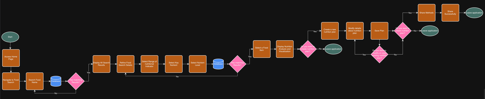

# Software Design Document

## Project Name: Desktop Application Project
## Group Number: 48

## Team members

| Student Number | Name      | 
|----------------|-----------|
| s5290341       | Zhongyue Qiu |
| s5226106       | Lowry Zhao | 
| s5261308       | Jiaxin Lin | 

# Table of Contents

<!-- TOC -->
* [Table of Contents](#table-of-contents)
  * [1. System Vision](#1-system-vision)
    * [1.1 Problem Background](#11-problem-background)
    * [1.2 System capabilities/overview](#12-system-capabilitiesoverview)
    * [1.3	Potential Benefits](#13potential-benefits)
  * [2. Requirements](#2-requirements)
    * [2.1 User Requirements](#21-user-requirements)
    * [2.2	Software Requirements](#22software-requirements)
    * [2.3 Use Case Diagrams](#23-use-case-diagrams)
    * [2.4 Use Cases](#24-use-cases)
  * [3.	Software Design and System Components](#3-software-design-and-system-components-)
    * [3.1	Software Design](#31software-design)
    * [3.2	System Components](#32system-components)
      * [3.2.1 Functions](#321-functions)
      * [3.2.2 Data Structures / Data Sources](#322-data-structures--data-sources)
      * [3.2.3 Detailed Design](#323-detailed-design)
  * [4. User Interface Design](#4-user-interface-design)
    * [4.1 Structural Design](#41-structural-design)
    * [4.2	Visual Design](#42visual-design)
<!-- TOC -->

## 1. System Vision

### 1.1 Problem Background

- Problem Identification:
  With the continuous development of living standards, people's demand for health and nutrition is increasing, but few   
  people go back to consult professional nutrition analyst and doctors. The development of this software is aimed at 
  helping people search and view specific information about the nutrients contained in various foods more easily and 
  quickly.
  
- Dataset:
  The dataset used by this software is Nutritional-Food-Database provided by the course, which contains detailed 
  nutritional information of various foods. These data include the names of various foods, as well as the specific values 
  of the nutrients provided, such as calories, fat, protein, and vitamins.
 
- Data Input/Output:
  
  Input:
  - Users can enter the name of a food in the search bar, click to select a specific food, or choose a specific range of 
    nutrients.
 
  Output:
  - By searching for the name of a food, specific data on all nutrients contained in that food will be displayed.
  - By selecting a single food, pie charts and bar charts will be displayed.
  - By screening the specifc range of nutrients, foods that meet the standards will be displayed.
 
- Target Users:
  - Nutritionist: Analyze and recommend foods based on different dietary needs.
  - Healthcare Professionals: Assess and provide recommendations based on health status.
  - The General Public: Improving health.
  

### 1.2 System capabilities/overview

- System Functionality:
  - Search and filtering: Users can search for food names and filter based on specific nutritional standards.
  - Data analysis and visualization: The system will allow users to analyze the nutritional composition of various foods       and visualize this data in a meaningful way.
  - Customization: Users can set their own unique nutrition plan and share it.

- Features and Functionalities:
  - Food search: Users can search for food by name and view detailed nutritional information.
  - Nutritional Analysis: For any selected food, users can view a detailed breakdown of its nutritional components through 
    pie charts and bar charts.
  - Nutritional Range Filter: Users can filter food by specifying the range of any nutritional indicator.
  - Nutrient Level Filter: Users can filter food based on pre-defined key nutrient levels (low, medium, high).
  - Nutrition Plan Development and Sharing: Users can create different nutrition plans and share them. Professionals can 
    use this feature to assist some confused users and provide them with a template.

### 1.3	Benefit Analysis

  - Time Saving: It saves users the time they need to collect information on their own, providing convenience not only for 
    ordinary users, but also for professionals and doctors.
  - Decision Making: By providing more accurate and professional data, users can analyze and make better decisions. Users 
    can also refer to plans shared by other users.
  - Health: By providing professional data to help users improve their health status and reduce the risk of illness.

## 2. Requirements

### 2.1 User Requirements

Detail how users are expected to interact with or use the program. What functionalities must the system provide from the end-user perspective? This can include both narrative descriptions and a listing of user needs.

Note: Since no specific client or user is assigned, you may create a fictional user. Who do you envision using your software?

Fictional User: Sarah, Nutritionist

Sarah is a 32-year-old nutritionist who runs her own practice. She works with a diverse clientele, including athletes, individuals with specific dietary restrictions, and people looking to improve their overall health through nutrition. Sarah needs a robust software system that can leverage the Comprehensive Nutritional Food Database to help her create personalized meal plans, analyze nutritional intake, and provide evidence-based recommendations to her clients.

User needs:

1.	Food Search and Filtering:

   - Users should be able to search for specific food items by name, category, or nutritional content.
   - The system must provide advanced filtering options (e.g., by macronutrients, micronutrients, allergens).

2.	Nutritional Information Display:
   - For each food item, the system should display comprehensive nutritional information as provided in the database.
   - Users should be able to view nutritional data in various units (e.g., grams, ounces, cups) and adjust serving sizes dynamically.

3.	Meal Planning:
   - Users should be able to create and save meal plans for their clients.
   - The system must allow users to add food items to meal plans and automatically calculate total nutritional values.
   - Users should be able to set nutritional goals and receive alerts if a meal plan exceeds or falls short of these goals.

4.	Nutritional Analysis:
   - The system should provide tools for analyzing the nutritional content of meals, daily intake, or custom time periods.
   - Users should be able to generate reports showing nutritional breakdowns, including macronutrient ratios and micronutrient levels.

5.	Client Management:
   - Users should be able to create and manage client profiles, including personal information, dietary restrictions, and health goals.
   - The system must allow users to associate meal plans and nutritional analyses with specific clients.

6.	Comparison Tools:
   - Users should be able to compare nutritional values of different food items side-by-side.
   - The system should provide functionality to find alternative food items with similar nutritional profiles.

7.	Data Export and Reporting:
   - Users should be able to export nutritional data, meal plans, and analyses in various formats (e.g., PDF, CSV).
   - The system must generate professional-looking reports for clients, summarizing meal plans and nutritional insights.

### 2.2	Software Requirements
Define the functionality the software will provide. This section should list requirements formally, often using the word "shall" to describe functionalities.

Example Functional Requirements:  
- R1.1 The program shall accept multiple file names as arguments from the command line.  
- R1.2 Each file name can be a simple file name or include the full path of the file with one or more levels.  

- etc …

Software Requirements: 
1.	Data Management and Access

 R1.1 The system shall provide access to the Comprehensive Nutritional Food Database.
 R1.2 The system shall allow users to search for food items by name, category, or nutritional content. 
 R1.3 The system shall support advanced filtering of food items based on nutritional criteria.

2.	Nutritional Information Display

R2.1 The system shall display comprehensive nutritional information for each food item. 
R2.2 The system shall allow users to view nutritional data in various units (e.g., grams, ounces, cups). 
R2.3 The system shall dynamically adjust nutritional information based on user-specified serving sizes.

3.	Meal Planning 

R3.1 The system shall enable users to create and save meal plans. 
R3.2 The system shall allow users to add food items to meal plans. 
R3.3 The system shall automatically calculate and display total nutritional values for meal plans. 
R3.4 The system shall allow users to set nutritional goals for meal plans. 
R3.5 The system shall alert users when a meal plan exceeds or falls short of set nutritional goals.

4.	Nutritional Analysis 

R4.1 The system shall provide tools for analyzing nutritional content of meals, daily intake, or custom time periods.
R4.2 The system shall generate reports showing nutritional breakdowns, including macronutrient ratios and micronutrient levels.

5.	Client Management 

R5.1 The system shall allow users to create and manage client profiles.
R5.2 The system shall enable users to associate meal plans and nutritional analyses with specific clients.

6.	Comparison Tools 

R6.1 The system shall allow users to compare nutritional values of different food items side-by-side. 
R6.2 The system shall provide functionality to find alternative food items with similar nutritional profiles.

7.	Data Export and Reporting 

R7.1 The system shall allow users to export nutritional data, meal plans, and analyses in PDF and CSV formats.
R7.2 The system shall generate professional-looking reports summarizing meal plans and nutritional insights.

### 2.3 Use Case Diagram

### 2.4 Use Cases

| Use Case ID    | UC-01      |
|----------------|------------|
| Use Case Name  |Food Search |
| Actors         |Target Users(Nutritionist, Healthcare Professionals, The General Public)|
| Description    |Users can search for food by name and view detailed nutritional information.|
| Flow of Events |1.User enter the desktop application.|
|                |2.User navigate to the search icon.|
|                |3.User enter the name of food they want to search.|
|                |4.System retrieve and display matching results from the database.|
|                |5.User view nutrtional information.|
| Alternate Flow |1.If there are no matching results, system inform the user and provide option for user to refine the search items.| 
|                |2.If the system has technical issues during the search process, the system notifies the user to try again later or contact IT support.|

| Use Case ID    | UC-02                  |
|----------------|------------------------|
| Use Case Name  |Nutritional Range Filter|
| Actors         |Target Users(Nutritionist, Healthcare Professionals, The General Public)|
| Description    |Users can filter food by specifying the range of any nutritional indicator.|
| Flow of Events |1.User access the range filtering icon in the desktop application.|
|                |2.User select the range of nutritional indicator.|
|                |3.The system retrieve and display the list of food items from the database.|
|                |4.User select a specifc food item and view the detailed nutritional information.|
| Alternate Flow |1.If there are no matching nutritional range, the system inform the user and provide options for user to refine the range or choose different nutritional indicator.| 
|                |2.If the system has technical issues during the range filter process, the system notify the user to try again later or contact IT support.|

| Use Case ID    | UC-03               |
|----------------|---------------------|
| Use Case Name  |Nutrient Level Filter|
| Actors         |Target Users(Nutritionist, Healthcare Professionals, The General Public)|
| Description    |Users can filter food based on pre-defined key nutrient levels (low, medium, high).|
| Flow of Events |1.User access the nutrient level filtering icon in the desktop application.|
|                |2.User select the key nutrient they want to filter.|
|                |3.User choose the pre-defined level of nutrient.|
|                |4.The system retrieve and display the list of food items that match for the selected nutrient level from the database.|
|                |5.User select a specific food item and view the detailed nutritional information.|
| Alternate Flow |1.If there are no matching selected nutrient level, the system inform the user and provide options for user to refine the nutrient level or choose another nutrient.| 
|                |2.If the system has technical issues during the nutrient level filter process, the system notify the user to try again later or contact IT support.|

| Use Case ID    | UC-04              |
|----------------|--------------------|
| Use Case Name  |Nutritional Analysis|
| Actors         |Target Users(Nutritionist, Healthcare Professionals, The General Public)|
| Description    |For any selected food, users can view a detailed breakdown of its nutritional components through pie charts and bar charts.|
| Flow of Events |1.User select a food item from the search results or range/level filter outputs.|
|                |2.User naviagate to the detailed nutritional analysis icon in the desktop application.|
|                |3.The system retrieve nutritional data for selected food items from the database.|
|                |4.The system generate and display the visual nutritional analysis outcomes (such as pie charts or bar charts) to present the detailed nutritional information for user.|
|                |5.User view the detailed nutritional information and explore additional details.|
| Alternate Flow |1.If there are no matching detailed nutritional data for selected food items, the system inform the user and provide options for user to refine the filter details or choose another food item.| 
|                |2.If the system has technical issues during the retrieve data or display visualisation process, the system notify the user to try again later or contact IT support.|

| Use Case ID    | UC-05                              |
|----------------|------------------------------------|
| Use Case Name  |Nutrition Plan Development & Sharing|
| Actors         |Target Users(Nutritionist, Healthcare Professionals, The General Public)|
| Description    |Users can create different nutritions plans and share them. Professionals can use this feature to assist some confused users and provide them with a template.|
| Flow of Events |1.User access the nutrition plan creation icon to start a new nutrition plan in the desktop application.|
|                |2.User specify the details information about their nutrition plans or goals|
|                |3.User add the food items for their daily meal plan, includes the portion sizes or quantities details.|
|                |4.User save the completed nutrition plan.|
|                |5.User has options to share the nutrition plan with others through email, social media or direct link.|
| Alternate Flow |1.If user want to modify or copy the existing nutrition plan, they have permission to access, edit and share it with multiple times.| 
|                |2.If the system has technical issues during the plan creation or sharing nutrition plan process, the system notify the user to try again later or contact IT support.|

## 3.	Software Design and System Components 

### 3.1	Software Design

### 3.2	System Components

#### 3.2.1 Functions
List all key functions within the software. For each function, provide:
- Description: Brief explanation of the function’s purpose.
- Input Parameters: List parameters, their data types, and their use.
- Return Value: Describe what the function returns.
- Side Effects: Note any side effects, such as changes to global variables or data passed by reference.

#### 3.2.2 Data Structures / Data Sources
List all data structures or sources used in the software. For each, provide:

- Type: Type of data structure (e.g., list, set, dictionary).
- Usage: Describe where and how it is used.
- Functions: List functions that utilize this structure.

#### 3.2.3 Detailed Design
Provide pseudocode or flowcharts for all functions listed in Section 3.2.1 that operate on data structures. For instance, include pseudocode or a flowchart for a custom searching function.

## 4. User Interface Design

### 4.1 Structural Design
Present a structural design, a hierarchy chart, showing the overall interface’s structure. Address:

- Structure: How will the software be structured?
- Information Grouping: How will information be organized?
- Navigation: How will users navigate through the software?
- Design Choices: Explain why these design choices were made.

### 4.2	Visual Design
Include all wireframes or mock-ups of the interface. Provide a discussion, explanation, and justification for your design choices. Hand-drawn wireframes are acceptable.

- Interface Components: Clearly label all components.
- Screens/Menus: Provide wireframes for different screens, menus, and options.
- Design Details: Focus on the layout and size of components; color and graphics are not required. 

Example:  

