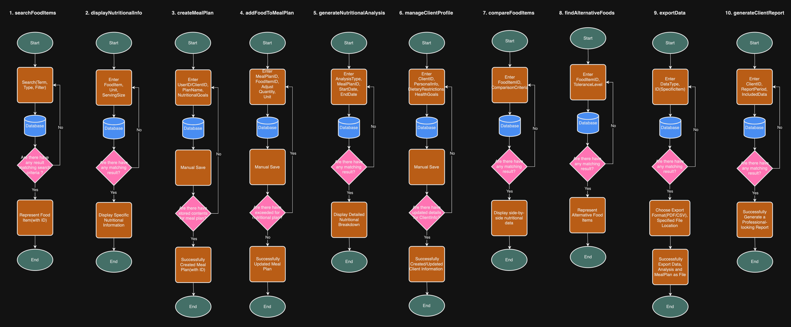
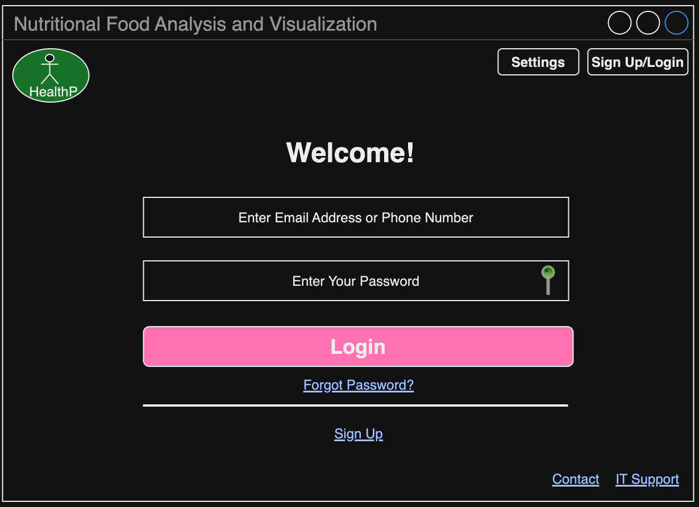

# Software Design Document

## Project Name: Desktop Application Project
## Group Number: 48

## Team members

| Student Number | Name      | 
|----------------|-----------|
| s5290341       | Zhongyue Qiu |
| s5226106       | Lowry Zhao | 
| s5261308       | Jiaxin Lin | 

# Table of Contents

<!-- TOC -->
* [Table of Contents](#table-of-contents)
  * [1. System Vision](#1-system-vision)
    * [1.1 Problem Background](#11-problem-background)
    * [1.2 System capabilities/overview](#12-system-capabilitiesoverview)
    * [1.3	Potential Benefits](#13potential-benefits)
  * [2. Requirements](#2-requirements)
    * [2.1 User Requirements](#21-user-requirements)
    * [2.2	Software Requirements](#22software-requirements)
    * [2.3 Use Case Diagrams](#23-use-case-diagrams)
    * [2.4 Use Cases](#24-use-cases)
  * [3.	Software Design and System Components](#3-software-design-and-system-components-)
    * [3.1	Software Design](#31software-design)
    * [3.2	System Components](#32system-components)
      * [3.2.1 Functions](#321-functions)
      * [3.2.2 Data Structures / Data Sources](#322-data-structures--data-sources)
      * [3.2.3 Detailed Design](#323-detailed-design)
  * [4. User Interface Design](#4-user-interface-design)
    * [4.1 Structural Design](#41-structural-design)
    * [4.2	Visual Design](#42visual-design)
<!-- TOC -->

## 1. System Vision

### 1.1 Problem Background

- Problem Identification:
  With the continuous development of living standards, people's demand for health and nutrition is increasing, but few   
  people go back to consult professional nutrition analyst and doctors. The development of this software is aimed at 
  helping people search and view specific information about the nutrients contained in various foods more easily and 
  quickly.
  
- Dataset:
  The dataset used by this software is Nutritional-Food-Database provided by the course, which contains detailed 
  nutritional information of various foods. These data include the names of various foods, as well as the specific values 
  of the nutrients provided, such as calories, fat, protein, and vitamins.
 
- Data Input/Output:
  
  Input:
  - Users can enter the name of a food in the search bar, click to select a specific food, or choose a specific range of 
    nutrients.
 
  Output:
  - By searching for the name of a food, specific data on all nutrients contained in that food will be displayed.
  - By selecting a single food, pie charts and bar charts will be displayed.
  - By screening the specifc range of nutrients, foods that meet the standards will be displayed.
 
- Target Users:
  - Nutritionist: Analyze and recommend foods based on different dietary needs.
  - Healthcare Professionals: Assess and provide recommendations based on health status.
  - The General Public: Improving health.
  

### 1.2 System capabilities/overview

- System Functionality:
  - Search and filtering: Users can search for food names and filter based on specific nutritional standards.
  - Data analysis and visualization: The system will allow users to analyze the nutritional composition of various foods       and visualize this data in a meaningful way.
  - Customization: Users can set their own unique nutrition plan and share it.

- Features and Functionalities:
  - Food search: Users can search for food by name and view detailed nutritional information.
  - Nutritional Analysis: For any selected food, users can view a detailed breakdown of its nutritional components through 
    pie charts and bar charts.
  - Nutritional Range Filter: Users can filter food by specifying the range of any nutritional indicator.
  - Nutrient Level Filter: Users can filter food based on pre-defined key nutrient levels (low, medium, high).
  - Nutrition Plan Development and Sharing: Users can create different nutrition plans and share them. Professionals can 
    use this feature to assist some confused users and provide them with a template.

### 1.3	Benefit Analysis

  - Time Saving: It saves users the time they need to collect information on their own, providing convenience not only for 
    ordinary users, but also for professionals and doctors.
  - Decision Making: By providing more accurate and professional data, users can analyze and make better decisions. Users 
    can also refer to plans shared by other users.
  - Health: By providing professional data to help users improve their health status and reduce the risk of illness.

## 2. Requirements

### 2.1 User Requirements

- Fictional User: Sarah, Nutritionist

  Sarah is a 32-year-old nutritionist who runs her own practice. She works with a diverse clientele, including athletes, individuals with specific 
  dietary restrictions, and people looking to improve their overall health through nutrition. Sarah needs a robust software system that can    
  leverage the Comprehensive Nutritional Food Database to help her create personalized meal plans, analyze nutritional intake, and provide 
  evidence-based recommendations to her clients.

- User needs:

1.	Food Search and Filtering:

   - Users should be able to search for specific food items by name, category, or nutritional content.
   - The system must provide advanced filtering options (e.g., by macronutrients, micronutrients, allergens).

2.	Nutritional Information Display:
   - For each food item, the system should display comprehensive nutritional information as provided in the database.
   - Users should be able to view nutritional data in various units (e.g., grams, ounces, cups) and adjust serving sizes dynamically.

3.	Meal Planning:
   - Users should be able to create and save meal plans for their clients.
   - The system must allow users to add food items to meal plans and automatically calculate total nutritional values.
   - Users should be able to set nutritional goals and receive alerts if a meal plan exceeds or falls short of these goals.

4.	Nutritional Analysis:
   - The system should provide tools for analyzing the nutritional content of meals, daily intake, or custom time periods.
   - Users should be able to generate reports showing nutritional breakdowns, including macronutrient ratios and micronutrient levels.

5.	Client Management:
   - Users should be able to create and manage client profiles, including personal information, dietary restrictions, and health goals.
   - The system must allow users to associate meal plans and nutritional analyses with specific clients.

6.	Comparison Tools:
   - Users should be able to compare nutritional values of different food items side-by-side.
   - The system should provide functionality to find alternative food items with similar nutritional profiles.

7.	Data Export and Reporting:
   - Users should be able to export nutritional data, meal plans, and analyses in various formats (e.g., PDF, CSV).
   - The system must generate professional-looking reports for clients, summarizing meal plans and nutritional insights.

- Beneficial users:

1.	Nutritionists:
   - They can customize personalized nutrition plans based on customer needs, manage their diet reasonably, and provide nutritional advice with specific data. The software helped them streamline their workflow and enable them to quickly and efficiently propose suggestions.

2.	Doctors:
   - They can provide more scientific nutrition plans for patients with certain special diseases, helping doctors better treat patients. The nutritional data filtering function in the software can better help doctors find suitable foods for patients.

### 2.2	Software Requirements

1.	Data Management and Access

R1.1 The system shall provide access to the Comprehensive Nutritional Food Database.
R1.2 The system shall allow users to search for food items by name, category, or nutritional content. 
R1.3 The system shall support advanced filtering of food items based on nutritional criteria.

2.	Nutritional Information Display

R2.1 The system shall display comprehensive nutritional information for each food item. 
R2.2 The system shall allow users to view nutritional data in various units (e.g., grams, ounces, cups). 
R2.3 The system shall dynamically adjust nutritional information based on user-specified serving sizes.

3.	Meal Planning 

R3.1 The system shall enable users to create and save meal plans. 
R3.2 The system shall allow users to add food items to meal plans. 
R3.3 The system shall automatically calculate and display total nutritional values for meal plans. 
R3.4 The system shall allow users to set nutritional goals for meal plans. 
R3.5 The system shall alert users when a meal plan exceeds or falls short of set nutritional goals.

4.	Nutritional Analysis 

R4.1 The system shall provide tools for analyzing nutritional content of meals, daily intake, or custom time periods.
R4.2 The system shall generate reports showing nutritional breakdowns, including macronutrient ratios and micronutrient levels.

5.	Client Management 

R5.1 The system shall allow users to create and manage client profiles.
R5.2 The system shall enable users to associate meal plans and nutritional analyses with specific clients.

6.	Comparison Tools 

R6.1 The system shall allow users to compare nutritional values of different food items side-by-side. 
R6.2 The system shall provide functionality to find alternative food items with similar nutritional profiles.

7.	Data Export and Reporting 

R7.1 The system shall allow users to export nutritional data, meal plans, and analyses in PDF and CSV formats.
R7.2 The system shall generate professional-looking reports summarizing meal plans and nutritional insights.

### 2.3 Use Case Diagram

### 2.4 Use Cases

| Use Case ID    | UC-01      |
|----------------|------------|
| Use Case Name  |Food Search |
| Actors         |Target Users(Nutritionist, Healthcare Professionals, The General Public)|
| Description    |Users can search for food by name and view detailed nutritional information.|
| Flow of Events |1.User enter the desktop application.|
|                |2.User navigate to the search icon.|
|                |3.User enter the name of food they want to search.|
|                |4.System retrieve and display matching results from the database.|
|                |5.User view nutrtional information.|
| Alternate Flow |1.If there are no matching results, system inform the user and provide option for user to refine the search items.| 
|                |2.If the system has technical issues during the search process, the system notifies the user to try again later or contact IT support.|

| Use Case ID    | UC-02                  |
|----------------|------------------------|
| Use Case Name  |Nutritional Range Filter|
| Actors         |Target Users(Nutritionist, Healthcare Professionals, The General Public)|
| Description    |Users can filter food by specifying the range of any nutritional indicator.|
| Flow of Events |1.User access the range filtering icon in the desktop application.|
|                |2.User select the range of nutritional indicator.|
|                |3.The system retrieve and display the list of food items from the database.|
|                |4.User select a specifc food item and view the detailed nutritional information.|
| Alternate Flow |1.If there are no matching nutritional range, the system inform the user and provide options for user to refine the range or choose different nutritional indicator.| 
|                |2.If the system has technical issues during the range filter process, the system notify the user to try again later or contact IT support.|

| Use Case ID    | UC-03               |
|----------------|---------------------|
| Use Case Name  |Nutrient Level Filter|
| Actors         |Target Users(Nutritionist, Healthcare Professionals, The General Public)|
| Description    |Users can filter food based on pre-defined key nutrient levels (low, medium, high).|
| Flow of Events |1.User access the nutrient level filtering icon in the desktop application.|
|                |2.User select the key nutrient they want to filter.|
|                |3.User choose the pre-defined level of nutrient.|
|                |4.The system retrieve and display the list of food items that match for the selected nutrient level from the database.|
|                |5.User select a specific food item and view the detailed nutritional information.|
| Alternate Flow |1.If there are no matching selected nutrient level, the system inform the user and provide options for user to refine the nutrient level or choose another nutrient.| 
|                |2.If the system has technical issues during the nutrient level filter process, the system notify the user to try again later or contact IT support.|

| Use Case ID    | UC-04              |
|----------------|--------------------|
| Use Case Name  |Nutritional Analysis|
| Actors         |Target Users(Nutritionist, Healthcare Professionals, The General Public)|
| Description    |For any selected food, users can view a detailed breakdown of its nutritional components through pie charts and bar charts.|
| Flow of Events |1.User select a food item from the search results or range/level filter outputs.|
|                |2.User naviagate to the detailed nutritional analysis icon in the desktop application.|
|                |3.The system retrieve nutritional data for selected food items from the database.|
|                |4.The system generate and display the visual nutritional analysis outcomes (such as pie charts or bar charts) to present the detailed nutritional information for user.|
|                |5.User view the detailed nutritional information and explore additional details.|
| Alternate Flow |1.If there are no matching detailed nutritional data for selected food items, the system inform the user and provide options for user to refine the filter details or choose another food item.| 
|                |2.If the system has technical issues during the retrieve data or display visualisation process, the system notify the user to try again later or contact IT support.|

| Use Case ID    | UC-05                              |
|----------------|------------------------------------|
| Use Case Name  |Nutrition Plan Development & Sharing|
| Actors         |Target Users(Nutritionist, Healthcare Professionals, The General Public)|
| Description    |Users can create different nutritions plans and share them. Professionals can use this feature to assist some confused users and provide them with a template.|
| Flow of Events |1.User access the nutrition plan creation icon to start a new nutrition plan in the desktop application.|
|                |2.User specify the details information about their nutrition plans or goals|
|                |3.User add the food items for their daily meal plan, includes the portion sizes or quantities details.|
|                |4.User save the completed nutrition plan.|
|                |5.User has options to share the nutrition plan with others through email, social media or direct link.|
| Alternate Flow |1.If user want to modify or copy the existing nutrition plan, they have permission to access, edit and share it with multiple times.| 
|                |2.If the system has technical issues during the plan creation or sharing nutrition plan process, the system notify the user to try again later or contact IT support.|

## 3.	Software Design and System Components 

### 3.1	Software Design

### 3.2	System Components

#### 3.2.1 Functions

Below is a list of key functions within the Nutritional Analysis System. Each function is described with its purpose, input parameters, return
value, and any side effects.

**1. Function Name: searchFoodItems**

- **Description**: Searches for food items in the Comprehensive Nutritional Food Database based on user-specified criteria.
- **Input Parameters**:
  - `searchTerm` (string): The search term entered by the user
  - `searchType` (enum): Type of search (e.g., by name, category, or nutritional content)
  - `filters` (object): Advanced filtering criteria (e.g., macronutrients, micronutrients, allergens)
- **Return Value**: Array of FoodItem objects matching the search criteria
- **Side Effects**: None

**2. Function Name: displayNutritionalInfo**

- **Description**: Displays comprehensive nutritional information for a specific food item.
- **Input Parameters**:
  - `foodItem` (FoodItem): The food item object
  - `unit` (enum): The unit of measurement (e.g., grams, ounces, cups)
  - `servingSize` (float): The serving size specified by the user
- **Return Value**: NutritionalInfo object containing adjusted nutritional data
- **Side Effects**: None

**3. Function Name: createMealPlan**

- **Description**: Creates a new meal plan for a user or client.
- **Input Parameters**:
  - `userId` (int): ID of the user creating the meal plan
  - `clientId` (int, optional): ID of the client for whom the meal plan is created
  - `planName` (string): Name of the meal plan
  - `nutritionalGoals` (object, optional): Nutritional goals for the meal plan
- **Return Value**: MealPlan object representing the created meal plan
- **Side Effects**: Stores the new meal plan in the database

**4. Function Name: addFoodToMealPlan**

- **Description**: Adds a food item to a specified meal plan and recalculates nutritional totals.
- **Input Parameters**:
  - `mealPlanId` (int): ID of the meal plan
  - `foodItemId` (int): ID of the food item to add
  - `quantity` (float): Quantity of the food item
  - `unit` (enum): Unit of measurement for the quantity
- **Return Value**: Updated MealPlan object
- **Side Effects**: Updates the meal plan in the database, may trigger alerts if nutritional goals are exceeded or not met

**5. Function Name: generateNutritionalAnalysis**

- **Description**: Generates a nutritional analysis report for a specified time period or meal plan.
- **Input Parameters**:
  - `analysisType` (enum): Type of analysis (e.g., meal, daily intake, custom period)
  - `mealPlanId` (int, optional): ID of the meal plan to analyze
  - `startDate` (Date, optional): Start date for custom period analysis
  - `endDate` (Date, optional): End date for custom period analysis
- **Return Value**: NutritionalAnalysis object containing detailed nutritional breakdown
- **Side Effects**: None

**6. Function Name: manageClientProfile**

- **Description**: Creates or updates a client profile with personal information and dietary details.
- **Input Parameters**:
  - `clientId` (int, optional): ID of the existing client (if updating)
  - `personalInfo` (object): Personal information of the client
  - `dietaryRestrictions` (array): List of dietary restrictions
  - `healthGoals` (object): Health and nutritional goals of the client
- **Return Value**: ClientProfile object representing the created or updated profile
- **Side Effects**: Creates or updates client information in the database

**7. Function Name: compareFoodItems**

- **Description**: Compares nutritional values of different food items side-by-side.
- **Input Parameters**:
  - `foodItemIds` (array of int): IDs of food items to compare
  - `comparisonCriteria` (array of string): Nutritional aspects to compare
- **Return Value**: ComparisonResult object containing side-by-side nutritional data
- **Side Effects**: None

**8. Function Name: findAlternativeFoods**

- **Description**: Finds alternative food items with similar nutritional profiles.
- **Input Parameters**:
  - `foodItemId` (int): ID of the reference food item
  - `toleranceLevel` (float): Acceptable difference in nutritional values (percentage)
- **Return Value**: Array of FoodItem objects representing alternatives
- **Side Effects**: None

**9. Function Name: exportData**

- **Description**: Exports nutritional data, meal plans, or analyses in specified format.
- **Input Parameters**:
  - `dataType` (enum): Type of data to export (e.g., nutritional data, meal plan, analysis)
  - `id` (int): ID of the specific item to export
  - `format` (enum): Export format (PDF or CSV)
- **Return Value**: File object containing the exported data
- **Side Effects**: Creates a file in the user's specified location

**10. Function Name: generateClientReport**

- **Description**: Generates a professional-looking report for a client, summarizing meal plans and nutritional insights.
- **Input Parameters**:
  - `clientId` (int): ID of the client
  - `reportPeriod` (object): Start and end dates for the report period
  - `includedData` (array of enum): Types of data to include in the report
- **Return Value**: Report object containing formatted report data
- **Side Effects**: None

#### 3.2.2 Data Structures / Data Sources

This document outlines the key data structures and sources used in the Nutritional Analysis System, including their types, usage, and associated 
functions.

**1. Comprehensive Nutritional Food Database**

- **Type**: External Database (likely relational)
- **Usage**: Stores all food items with their nutritional information. This is the primary data source for the entire system.
- **Functions**:
  - `searchFoodItems`
  - `displayNutritionalInfo`
  - `findAlternativeFoods`

**2. FoodItem**

- **Type**: Class/Object
- **Usage**: Represents individual food items with their nutritional properties.
- **Functions**:
  - `displayNutritionalInfo`
  - `addFoodToMealPlan`
  - `compareFoodItems`

**3. NutritionalInfo**

- **Type**: Class/Object
- **Usage**: Contains detailed nutritional information for food items or meal plans.
- **Functions**:
  - `displayNutritionalInfo`
  - `generateNutritionalAnalysis`

**4. MealPlan**

- **Type**: Class/Object with embedded list of FoodItems
- **Usage**: Represents a meal plan created by a user, including associated food items and nutritional goals.
- **Functions**:
  - `createMealPlan`
  - `addFoodToMealPlan`
  - `generateNutritionalAnalysis`

**5. ClientProfile**

- **Type**: Class/Object
- **Usage**: Stores information about individual clients, including personal details, dietary restrictions, and health goals.
- **Functions**:
  - `manageClientProfile`
  - `createMealPlan`
  - `generateClientReport`

**6. NutritionalGoals**

- **Type**: Dictionary/Object
- **Usage**: Defines nutritional targets for meal plans or clients.
- **Functions**:
  - `createMealPlan`
  - `addFoodToMealPlan` (for checking against goals)
  - `generateNutritionalAnalysis`

**7. ComparisonResult**

- **Type**: Custom Object/Dictionary
- **Usage**: Stores the result of comparing multiple food items.
- **Functions**:
  - `compareFoodItems`

**8. NutritionalAnalysis**

- **Type**: Class/Object
- **Usage**: Represents the result of a nutritional analysis, including breakdowns and insights.
- **Functions**:
  - `generateNutritionalAnalysis`
  - `exportData`
  - `generateClientReport`

**9. UserPreferences**

- **Type**: Dictionary/Object
- **Usage**: Stores user-specific settings such as preferred units of measurement and display preferences.
- **Functions**:
  - `displayNutritionalInfo`
  - `exportData`

**10. ExportFormat**

- **Type**: Enum
- **Usage**: Defines available export formats (e.g., PDF, CSV).
- **Functions**:
  - `exportData`

**11. SearchFilters**

- **Type**: Dictionary/Object
- **Usage**: Stores advanced search and filtering criteria for food items.
- **Functions**:
  - `searchFoodItems`

**12. Report**

- **Type**: Class/Object
- **Usage**: Represents a formatted report containing meal plans, nutritional analyses, and insights for clients.
- **Functions**:
  - `generateClientReport`
  - `exportData`

**13. AlternativeFoodsList**

- **Type**: List of FoodItem objects
- **Usage**: Stores food items with similar nutritional profiles to a reference item.
- **Functions**:
  - `findAlternativeFoods`

**14. NutrientUnit**

- **Type**: Enum
- **Usage**: Defines units of measurement for nutritional information (e.g., grams, ounces, cups).
- **Functions**:
  - `displayNutritionalInfo`
  - `addFoodToMealPlan`

**15. AlertSystem**

- **Type**: Class/Object
- **Usage**: Manages and triggers alerts when meal plans exceed or fall short of nutritional goals.
- **Functions**:
  - `addFoodToMealPlan`
  - `generateNutritionalAnalysis`

#### 3.2.3 Detailed Design

## 4. User Interface Design

### 4.1 Structural Design
**1. Structure:**
- The software will use a hierarchical structure, with specific examples provided in the charts. The interface will start with the main function interface, which will be divided into several key parts and possess all the core functions.

**2. Information Grouping:**
- **Main**: The starting point for users to open applications and access all functions.
- **Food Search**: Allow users to search and display specific data.
- **Nutrition Breakdown**: Convert the nutritional content of the selected food into pie charts and bar charts.
- **Nutrition Filter**: Users can not only screen and filter based on the range of nutritional value, but also classify food into low, medium, and high nutritional levels.
- **Nutrition Plan**: Users can create and share plan.

**3. Navigation:**
- **Main Page**: The page that the user will enter when opening the software leads to all functional pages.
- **Subpage**: Each different function will have a different page, and users can choose according to the function they want to use, and each page can return to the main page.
- **Return Navigation**: Users can use the "Return" button to choose to return to the previous page, and use the "Return to Home" button to return to the main page.

**4. Design Choices:**
- Using a hierarchical structure can ensure that users can easily find the functions they need, and putting related functions together can help users better use the software.

### 4.2	Visual Design

- Interface Components: All the components with its funtions according to the section 3.2 system components, including search function, filter function, the function of get nutrition visualization results, creat nutrition plan function, save function and share function.
  
- Screens/Menus: For this desktop application, it contains ten screens and three main menus access, these design follow to the 4.1 structural design.

- Design Details: All the screens use same layout, the logo is on top left corner of each screen. It contains people icon, health meaning and green color means nutritional food. The button use light pink color for user can easily access. The alternative button to access another page by using blue color font and underline, which is a link access function. 
 

