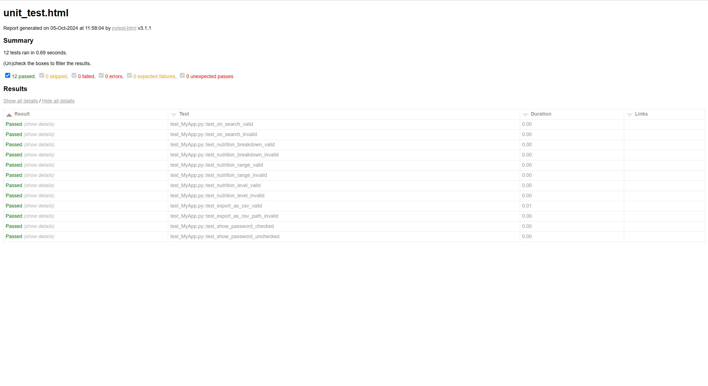

# Unit Testing Report

### GitHub Repository URL: https://github.com/LowryZhao/Milestone1-2_Group48.git

---

The testing report should focus solely on <span style="color:red"> testing all the self-defined functions related to 
the five required features.</span> There is no need to test the GUI components. Therefore, it is essential to decouple your code and separate the logic from the GUI-related code.


## 1. **Test Summary**
list all tested functions related to the five required features and the corresponding test functions designed to test 
those functions, for example:

| **Tested Functions** | **Test Functions**                               |
|----------------------|--------------------------------------------------|
| `on_search(food_name)`         | `test_nutrition_breakdown_valid()` <br> `test_nutrition_breakdown_invalid()`       |
| `nutrition_range_filter(selected_nutrition, min_value, max_value)	`      | `test_nutrition_range_valid()` <br> `test_nutrition_range_invalid()` |
| `nutrition_level_filter(selected_nutrition, selected_level)`                | `test_nutrition_level_valid()` <br> `test_nutrition_level_valid()` |
| `export_as_csv(nutrient_data, path)`         | `test_export_as_csv_valid()` <br> `test_export_as_csv_path_invalid()`       |
| `show_password()`         | `test_show_password_checked()` <br> `test_show_password_unchecked()`       |

---

## 2. **Test Case Details**

### Test Case 1: on_search(food_name)
- **Test Function/Module**
  - `test_on_search_valid()`
  - `test_on_search_invalid()`
- **Tested Function/Module**
  - `divide(Apple, Banana)`
- **Description**
  - The purpose of this test function is to search for matching foods in the dataset, where the input (foodname) represents the name of the food. This function will output data containing search results.
- **1) Valid Input and Expected Output**  

| **Valid Input**               | **Expected Output** |
|-------------------------------|---------------------|
| `Apple`               | `DataFrame containing Apple information`                 |
| `Banana`              | `DataFrame containing Banana information`                |

- **1) Code for the Test Function**
```python
def test_on_search_valid():
    df = pd.DataFrame({'food': ['apple', 'banana', 'cherry']})
    result = on_search('apple', df)
    assert not result.empty
    assert 'apple' in result['food'].values
```
- **2) Invalid Input and Expected Output**

| **Invalid Input**             | **Expected Output** |
|-------------------------------|---------------------|
| `unknown_food`               | `Returns an empty dataframe`  |
| `empty string` | `Returns an empty dataframe`               |

- **2) Code for the Test Function**
```python
def test_on_search_invalid():
    df = pd.DataFrame({'food': ['apple', 'banana', 'cherry']})
    result = on_search('unknown_food', df)
    assert result.empty
    result = on_search('', df)
    assert result.empty
```
### Test Case 2: nutrition_breakdown(get_searched)
- **Test Function/Module**
  - `test_nutrition_breakdown_valid()`
  - `test_nutrition_breakdown_invalid()`
- **Tested Function/Module**
  - `divide(a, b)`
- **Description**
  - A brief description of the tested function's usage, including its purpose, input, and output.
- **1) Valid Input and Expected Output**  

| **Valid Input**               | **Expected Output** |
|-------------------------------|---------------------|
| `divide(10, 2)`               | `5`                 |
| `divide(10, -2)`              | `-5`                |
| `add more cases in necessary` | `...`               |

- **1) Code for the Test Function**
```python
def test_divide_valid():
    assert divide(10, 2) == 5
    assert divide(10, -2) == -5
```
- **2) Invalid Input and Expected Output**

| **Invalid Input**             | **Expected Output** |
|-------------------------------|---------------------|
| `divide(10, 0)`               | `Handle Exception`  |
| `add more cases in necessary` | `...`               |

- **2) Code for the Test Function**
```python
def test_divide_invalid():
    with pytest.raises(ValueError) as exc_info:
        divide(10, 0)
    assert exc_info.type is ValueError
```

### Test Case 3:
- **Test Function/Module**
  - `test_divide_valid()`
  - `test_divide_invalid()`
- **Tested Function/Module**
  - `divide(a, b)`
- **Description**
  - A brief description of the tested function's usage, including its purpose, input, and output.
- **1) Valid Input and Expected Output**  

| **Valid Input**               | **Expected Output** |
|-------------------------------|---------------------|
| `divide(10, 2)`               | `5`                 |
| `divide(10, -2)`              | `-5`                |
| `add more cases in necessary` | `...`               |

- **1) Code for the Test Function**
```python
def test_divide_valid():
    assert divide(10, 2) == 5
    assert divide(10, -2) == -5
```
- **2) Invalid Input and Expected Output**

| **Invalid Input**             | **Expected Output** |
|-------------------------------|---------------------|
| `divide(10, 0)`               | `Handle Exception`  |
| `add more cases in necessary` | `...`               |

- **2) Code for the Test Function**
```python
def test_divide_invalid():
    with pytest.raises(ValueError) as exc_info:
        divide(10, 0)
    assert exc_info.type is ValueError
```

### Test Case 4:
- **Test Function/Module**
  - `test_divide_valid()`
  - `test_divide_invalid()`
- **Tested Function/Module**
  - `divide(a, b)`
- **Description**
  - A brief description of the tested function's usage, including its purpose, input, and output.
- **1) Valid Input and Expected Output**  

| **Valid Input**               | **Expected Output** |
|-------------------------------|---------------------|
| `divide(10, 2)`               | `5`                 |
| `divide(10, -2)`              | `-5`                |
| `add more cases in necessary` | `...`               |

- **1) Code for the Test Function**
```python
def test_divide_valid():
    assert divide(10, 2) == 5
    assert divide(10, -2) == -5
```
- **2) Invalid Input and Expected Output**

| **Invalid Input**             | **Expected Output** |
|-------------------------------|---------------------|
| `divide(10, 0)`               | `Handle Exception`  |
| `add more cases in necessary` | `...`               |

- **2) Code for the Test Function**
```python
def test_divide_invalid():
    with pytest.raises(ValueError) as exc_info:
        divide(10, 0)
    assert exc_info.type is ValueError
```


### Test Case 5:
- **Test Function/Module**
  - `test_divide_valid()`
  - `test_divide_invalid()`
- **Tested Function/Module**
  - `divide(a, b)`
- **Description**
  - A brief description of the tested function's usage, including its purpose, input, and output.
- **1) Valid Input and Expected Output**  

| **Valid Input**               | **Expected Output** |
|-------------------------------|---------------------|
| `divide(10, 2)`               | `5`                 |
| `divide(10, -2)`              | `-5`                |
| `add more cases in necessary` | `...`               |

- **1) Code for the Test Function**
```python
def test_divide_valid():
    assert divide(10, 2) == 5
    assert divide(10, -2) == -5
```
- **2) Invalid Input and Expected Output**

| **Invalid Input**             | **Expected Output** |
|-------------------------------|---------------------|
| `divide(10, 0)`               | `Handle Exception`  |
| `add more cases in necessary` | `...`               |

- **2) Code for the Test Function**
```python
def test_divide_invalid():
    with pytest.raises(ValueError) as exc_info:
        divide(10, 0)
    assert exc_info.type is ValueError
```

### Test Case 6:

add more test cases if necessary.

## 3. **Testing Report Summary**
Include a screenshot of unit_test.html showing the results of all the above tests. 

You can use the following command to run the unit tests and generate the unit_test.html report.

```commandline
pytest test_all_functions.py --html=unit_test.html --self-contained-html
```
Note: test_all_functions.py should contain all the test functions designed to test the self-defined functions related 
to the five required features.


